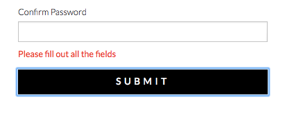
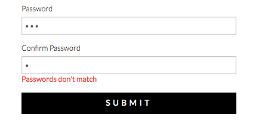
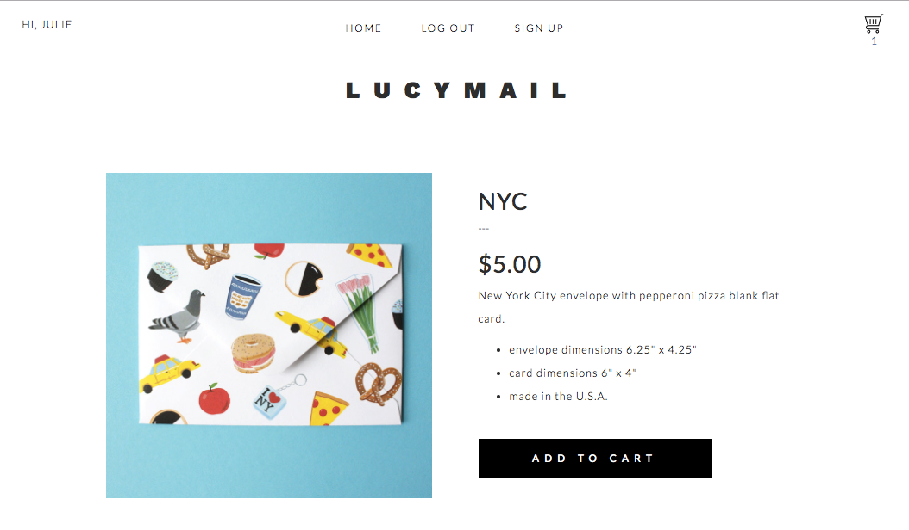
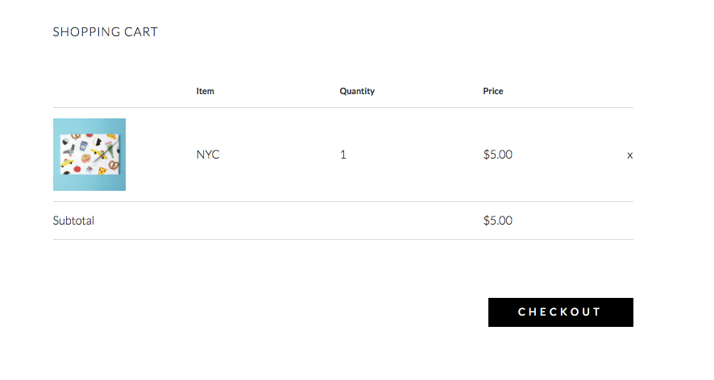
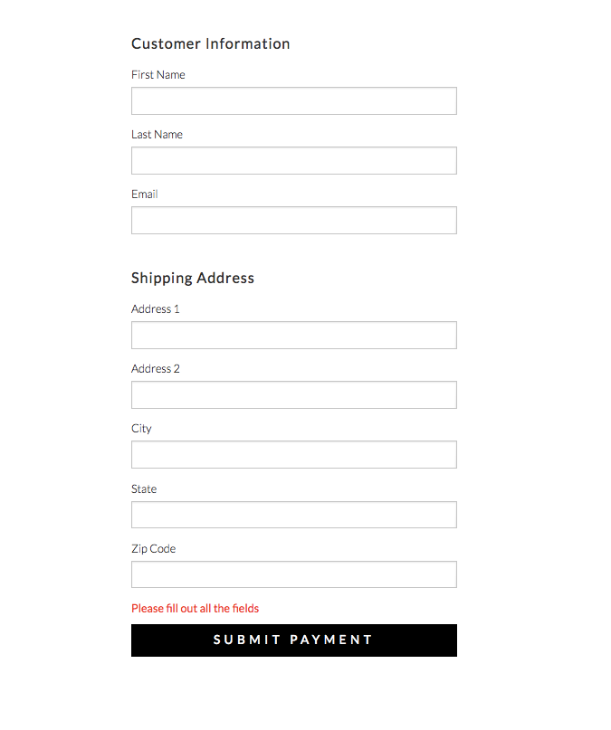
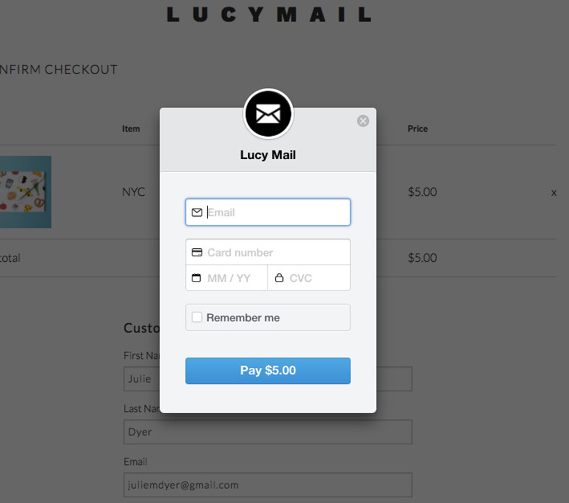
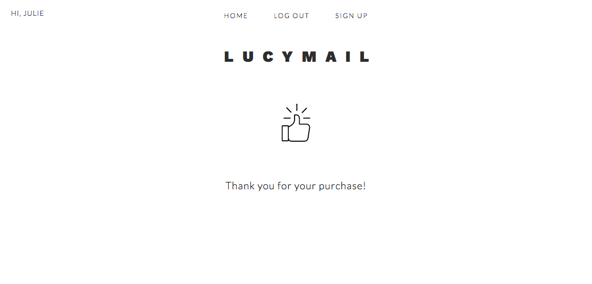

# Lucy Mail
---
## [Live Demo](http://www.lucymail.juliemdyer.com)

## What It Is
This is an e-commerce app I built using React, Redux and the Stripe API. It is a clone of my friend Lucy Halcomb's online store lucymail.com where she sells her hand painted envelopes and note cards. I got her permission to make a clone of her website so I could practice building an e-commerce website.


## What I used
* React
* Redux
* Express
* Node.js
* Postgres
* Stripe API
* Ajax
* HTML
* CSS
* jQuery


## Site walkthrough
### Homepage
The home page is where all the products are shown. If a user is already logged in they will see a greeting at the top left corner. If the user has items in their shopping car they will see the cart image with the number of items. The middle nav button will show Log Out instead of log in.
<p align='center'>
    </img>
</p>

### Login button
When the log in button is clicked the title is swapped out for a log in form. Once logged in the user will see the layout above.
<p align='center'>
    </img>
</p>

### Sign Up form
Basic form to get user information. If all fields are not filled out when user clicks submit a message pops up saying they need to fill out all fields.
<p align='center'>
    </img>
</p>
Similarly, if the passwords don't match the user gets an error message and can't submit the form until the passwords match.
<p align='center'>
    </img>
</p>

### Item details
When a user clicks an image on the home page they are taken to a details page for that item. From there they can see details about the item which are pulled from the database. If the user is signed in they can click Add to cart. If not, they will be shown a similar error message as above asking them to log in or sign up. When an item is added the number under the shopping cart will increase.
<p align='center'>
    </img>
</p>

### Shopping cart
When a user clicks the shopping cart in the top right corner they are taken to the shopping cart page where they can see a summary of the items in their cart and a subtotal. Users can click the x on the right to remove the item from thier shopping cart.
<p align='center'>
    </img>
</p>

### Checkout
When a user is ready to check out they can click the checkout button and will be shown the customer and shipping info form. Error handling happens again here to make sure necessary fields are filled out.
<p align='center'>
    </img>
</p>

### Submit payment
When the users is ready to check out they click the submit payment button and the stripe pop up opens to enter their credit card information.
<p align='center'>
    </img>
</p>

### Purchase successful
When a purchase is successful the user is re-directed to the thank you page and thier shopping cart is cleared out.
<p align='center'>
    </img>
</p>


## Challenges

### Working with tokens
In past applications we've used express session to remember information about users. This time I did this with tokens using the uuid module. To do this needed to save a token in the state for a user when they are logged in. I created a token at 2 points in the application - when the user successfully logs in or when they successfully create an account. This happens in the backend. After the token is created it's sent to the front end and dispatched via an action to the reducer which adds the token to the state for that user.
<br>
I also used the npm module js-cookie to add that token to the browser cookies so that information (token and user-name) would be remembered.
<br>
Code below for generating the cookie in the server side javascript file. This is the path for signing up a new user. First the user details is sent over from the front end. The password is hashed and inserted into the database, returning all the user details. Then the token is created, and the token is inserted into the tokens table along with the corresponding user's user id. Then the data is sent back to the front end via resp.json.
```JavaScript
app.post('/api/user/signup', (req, resp, next) => {
    let user = req.body;
    bcrypt.hash(user.password, 10)
        .then(encrypted => {
            return db.one(`insert into users values (default, $1, $2, $3, $4, $5, $6, $7, $8, $9) returning *`, [user.first_name, user.last_name, user.address_1, user.address_2, user.city, user.state, user.zip, user.email, encrypted])
        })
        .then(loginDetails => {
            let token = uuid.v4();
            return [loginDetails, db.one(`insert into tokens values (default, $1, $2) returning token`, [loginDetails.id, token])]
        })
        .spread((loginDetails, token) => {
            let newData = {
                first_name: loginDetails.first_name,
                id: loginDetails.id,
                token: token
            }
            resp.json(newData);
        })
        .catch((error) => {
            if (error.message === 'duplicate key value violates unique constraint "users_email_key"') {
                resp.status(409);
                resp.json({message: "User with that email already exists"});
            } else {
                throw error;
            }
        })
        .catch(next);
})
```
This is a code snippet from the actions file which shows the sending over of the user data, and then the receipt of the new user data which will be dispatched to the reducer.

```Javascript
export function submitSignUp(first, last, address1, address2, city, state, zip, email, password) {
    let asyncAction = function(dispatch) {
        $.ajax({
            type: 'POST',
            url: BASEURL + '/api/user/signup',
            contentType: 'application/json',
            data: JSON.stringify({
                first_name: first,
                last_name: last,
                address_1: address1,
                address_2: address2,
                city: city,
                state: state,
                zip: zip,
                email: email,
                password: password
            })
        })
        .then(data => {
            hashHistory.push('/');
            dispatch({
                type: 'login-successful',
                payload: data
            })
        })
        .catch(resp => {
            let error = (resp && resp.responseJSON && resp.responseJSON.message) || 'Something went wrong'
            alert(error + '. Please try again.');
        })
    }
    return asyncAction;
}
```

This final code snippet is from the reducer file which shows the state being updated and the cookies added.
```Javascript
} else if (action.type === 'login-successful') {
    Cookies.set('token', action.payload.token);
    Cookies.set('name', action.payload.first_name);
    return Object.assign({}, state, {
        token: action.payload.token,
        first_name: action.payload.first_name,
        user_id: action.payload.id,
        showLogin: false,
        empty_fields: false
    })
}
```

### Using the Stripe API
The documentation for the Stripe API is actually really helpful, but it still took me some time to get it working. The first step is sending a request to stripe with the user's credit card info. If the credit card is verified you receive a token back. That token then needs to be sent to the backend which will make another request to actually charge the card. If all of that goes well the backend will also update the database accordingly.
<br>
This whole thing is triggered by the submit button on the checkout page. The function chargeCard below is called. The handler is basically the pop up that is created. It triggers the callback function which returns the token. After that the ajax request is sent to the backend with the stripe token, the user's email and the amount that needs to be charged.  

```JavaScript
export function chargeCard(amount, cookieToken, email) {
    let asyncAction = function(dispatch) {
        let handler = StripeCheckout.configure({
            key: 'pk_test_mHlocB4xkrc0EgJxchCMRjFs',
            image: '/envelope.png',
            locale: 'auto',
            token: function callback(token) {
                var stripeToken = token.id;
                console.log('Public stripe token recieved if payment info verified: ', stripeToken);
                // If verified, send stripe token to backend
                $.ajax({
                    type: 'POST',
                    url: BASEURL + '/api/pay',
                    contentType: 'application/json',
                    data: JSON.stringify({
                        stripeToken: stripeToken,
                        email: email,
                        amount: amount
                    })
                })
                // After payment is processed in the back end send another request to update the database and set state
                .then(response => {
                    $.ajax({
                        type: 'POST',
                        url: BASEURL + '/api/checkout',
                        contentType: 'application/json',
                        data: JSON.stringify({
                            token: cookieToken
                        })
                    })
                    .then(response => {
                        hashHistory.push('/thanks');
                        dispatch({
                            type: 'purchase-successful'
                        })
                    })
                })
            }
        });
        handler.open({
            name: 'Lucy Mail',
            amount: amount
        });
    }
    return asyncAction;
}

```
The corresponding server side code is below. The stripe module creates a customer with the given email address. The customer then creates a source with the stripe token, which is kind of like a blueprint for the user's card without actually showing the card details. To test this I went into the stripe dashboard and at this point I could see the details of the charge. If all of that is successful I send a purchase successful message. The front end will then send another ajax request to the backend to update the database accordingly. When that is successful finally the page will redirect to the thank you page and the state of the shopping cart will be cleared out.

```JavaScript
app.post('/api/pay', (req, resp, next) => {
    let stripeToken = req.body.stripeToken;
    let email = req.body.email;
    let amount = req.body.amount;
    stripe.customers.create({
            email: email
        })
        .then(customer => {
            return stripe.customers.createSource(customer.id, {
                source: stripeToken
            });
        })
        .then(source => {
            return stripe.charges.create({
                amount: amount,
                currency: 'usd',
                customer: source.customer,
                description: 'Test Charge'
            });
        })
        .then(charge => {
            console.log(charge);
        })
        .catch(err => {
            console.log(err.message);
        })
    resp.json({message: "purchase successful"});
})
```

### Using forms in React
This is one of those things that I just don't love about react. In a React / Redux app everything on the display must come from the state, which is a representation of the virtual dom. So that includes data in form fields. Meaning, on every keypress in a form the state has to be updated. I think there's probably a simpler way to do this but what I ended up doing was dispatching a typing action for each onChange event in the form, and updating the state for that particular field.
<br>
This is the code from the SignUp form component. On change I am calling the typing action and passing in the field that is being typed in. The event will contain the value to be used in the next step.
```Javascript
<div className="form-group">
    <label>First Name</label>
    <input onChange={(event)=> this.props.typing(event, 'first-name')}className="form-control" type="text"></input>
</div>
<div className="form-group">
    <label>Last Name</label>
    <input onChange={(event)=> this.props.typing(event, 'last-name')} className="form-control" type="text"></input>
</div>
```

This code is from the actions file. The function has 2 parameters, the event - which contains the value of what is being typed in the filed; and the field - which is a string for the name of the field. The action is then dispatched to the reducer to update the state.
```Javascript
export function typing(event, field) {
    return {
        type: field,
        value: event.target.value
    }
}
```
Over in the reducer I have separate cases for each field. This is where I'm sure there's a better way. But it does work! Now if I go look in my redux tools ill see that the state has been updated for these fields.
```Javascript
} else if (action.type === 'first-name') {
    return Object.assign({}, state, {
        first_name: action.value
    })
} else if (action.type === 'last-name') {
    return Object.assign({}, state, {
        last_name: action.value
    })
}
```
